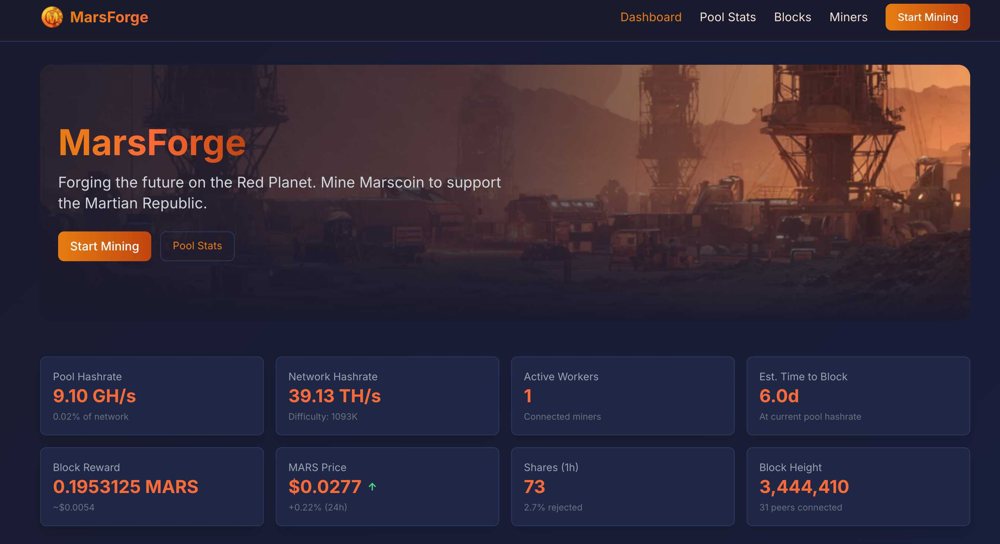

# MarsForge

**A modern, open-source mining pool frontend for [Marscoin](https://marscoin.org)**



MarsForge is a Next.js dashboard that sits on top of a [YIIMP](https://github.com/tpruvot/yiimp) mining pool backend. It provides real-time pool statistics, a block explorer, miner listings, and a getting-started guide -- all reading from the existing YIIMP MySQL database without modifying it.

**Live:** [mining-mars.com](https://mining-mars.com)


---

## Features

- **Real-time Dashboard** -- Pool hashrate, active workers, network difficulty, and block rewards with 30-second auto-refresh
- **Block Explorer** -- Paginated block history with status badges (confirmed / immature / orphan), block hashes linked to the Marscoin explorer
- **Pool Statistics** -- Coin info, pool configuration, hashrate history chart, and recent payouts
- **Miner Listings** -- Active and inactive miners with hashrate, worker count, pending balance, and last earning time
- **Wallet Lookup** -- Enter a MARS address to view workers, earnings, and balance
- **Getting Started Guide** -- Step-by-step mining setup with copy-paste commands for cpuminer-multi, cgminer, and bfgminer, plus password options (solo mining, fixed difficulty, party mode)
- **Mars Theme** -- Dark UI built on CSS custom properties (`--mars-red`, `--mars-orange`, `--mars-rust`, etc.) for easy re-theming

## Architecture

MarsForge is a **read-only UI layer**. It connects to the YIIMP MySQL database with SELECT-only access and never writes to it. The stratum server, block processing, and payouts all remain handled by YIIMP.

```
                    ┌──────────────┐
                    │    Miners    │
                    │  (stratum)   │
                    └──────┬───────┘
                           │
                    ┌──────┴───────┐     ┌──────────────┐
                    │    YIIMP     │────>│   Marscoin   │
                    │  stratum +   │     │   Node (RPC) │
                    │   backend    │     └──────────────┘
                    └──────┬───────┘
                           │
                     ┌─────┴─────┐
                     │   MySQL   │
                     │  (yiimp)  │
                     └─────┬─────┘
                           │ SELECT only
                    ┌──────┴───────┐
                    │  MarsForge   │
                    │  (Next.js)   │
                    │  port 3000   │
                    └──────┬───────┘
                           │
                    ┌──────┴───────┐
                    │ Apache/Nginx │
                    │ reverse proxy│
                    └──────────────┘
```

## Project Structure

```
marsforge/
├── src/
│   ├── app/
│   │   ├── page.tsx                  # Dashboard (home)
│   │   ├── layout.tsx                # Root layout -- navbar + footer
│   │   ├── globals.css               # Mars theme + component classes
│   │   ├── start/page.tsx            # Getting started guide
│   │   ├── pool/page.tsx             # Pool statistics
│   │   ├── blocks/page.tsx           # Block explorer with pagination
│   │   ├── miners/page.tsx           # Miner listings
│   │   └── api/
│   │       ├── pool/route.ts         # Pool stats endpoint
│   │       ├── blocks/route.ts       # Block history endpoint
│   │       ├── hashrate/route.ts     # Hashrate history endpoint
│   │       ├── miners/route.ts       # Miner accounts endpoint
│   │       ├── payouts/route.ts      # Payout history endpoint
│   │       └── wallet/
│   │           └── [address]/
│   │               └── route.ts      # Per-wallet stats endpoint
│   └── lib/
│       └── db.ts                     # MySQL connection pool + queries
├── .env.local                        # Credentials (not committed)
├── .gitleaks.toml                    # Secret detection config
├── tailwind.config.ts
├── next.config.mjs
└── package.json
```

## Quick Start

### Prerequisites

| Requirement | Version | Notes |
|---|---|---|
| Node.js | 18+ (20 recommended) | Use [nvm](https://github.com/nvm-sh/nvm) to manage versions |
| YIIMP | Any recent fork | Must have a running MySQL database |
| Apache or Nginx | Any | Only needed for production reverse proxy |

### 1. Clone and install

```bash
git clone https://github.com/marscoin/marsforge.git
cd marsforge
npm install
```

### 2. Configure the database

Create `.env.local` in the project root:

```env
# Database (YIIMP MySQL)
DB_HOST=localhost
DB_USER=marsforge
DB_PASSWORD=your_secure_password
DB_NAME=yiimp

# Pool branding
NEXT_PUBLIC_POOL_NAME=MarsForge
NEXT_PUBLIC_POOL_URL=mining-mars.com
NEXT_PUBLIC_STRATUM_URL=mining-mars.com
NEXT_PUBLIC_STRATUM_PORT=3433

# Block explorer
NEXT_PUBLIC_EXPLORER_URL=https://explore.marscoin.org
```

For security, create a dedicated read-only MySQL user:

```sql
CREATE USER 'marsforge'@'localhost' IDENTIFIED BY 'your_secure_password';
GRANT SELECT ON yiimp.* TO 'marsforge'@'localhost';
FLUSH PRIVILEGES;
```

### 3. Run

```bash
# Development (hot reload)
npm run dev

# Production
npm run build
npm start
```

Open [http://localhost:3000](http://localhost:3000).

## API Reference

All endpoints return `{ success: boolean, data: ... }`.

| Endpoint | Description | Query Parameters |
|---|---|---|
| `GET /api/pool` | Pool stats: coins, hashrate, worker count, block count | -- |
| `GET /api/blocks` | Block history with pagination | `limit` (default 25), `offset` (default 0) |
| `GET /api/hashrate` | Hashrate time series for charting | `algo` (default `scrypt`), `hours` (default 24) |
| `GET /api/miners` | Miner accounts with current hashrate | -- |
| `GET /api/payouts` | Recent payout transactions | -- |
| `GET /api/wallet/:address` | Workers, balance, and earnings for a wallet | -- |

### Examples

```bash
# Pool overview
curl -s https://forge.mining-mars.com/api/pool | jq .

# Last 10 blocks
curl -s 'https://forge.mining-mars.com/api/blocks?limit=10' | jq .

# Wallet lookup
curl -s https://forge.mining-mars.com/api/wallet/MVk86WKySkawkjRqmiazWMnbrf39qpCkLD | jq .

# 48-hour hashrate history
curl -s 'https://forge.mining-mars.com/api/hashrate?algo=scrypt&hours=48' | jq .
```

## YIIMP Database Tables

MarsForge reads from these tables (all SELECT-only):

| Table | What MarsForge uses it for |
|---|---|
| `coins` | Coin name, algo, difficulty, block height, price, reward, connections |
| `blocks` | Block history, confirmations, category, hashes, difficulty |
| `workers` | Currently connected miners (live worker count) |
| `accounts` | Registered miner accounts and pending balances |
| `earnings` | Per-miner earning records |
| `payouts` | Completed and pending payout transactions |
| `hashstats` | Aggregated pool hashrate over time |
| `hashuser` | Per-user hashrate history (for active miner detection) |
| `hashrate` | Detailed hashrate with bad-share tracking |

## Production Deployment

### PM2 process manager

```bash
npm run build
npm install pm2
npx pm2 start npm --name "marsforge" -- start
npx pm2 save
npx pm2 startup   # auto-start on reboot
```

### Apache reverse proxy

```apache
<VirtualHost *:80>
    ServerName forge.your-pool.com

    ProxyPreserveHost On
    ProxyPass / http://127.0.0.1:3000/
    ProxyPassReverse / http://127.0.0.1:3000/

    ErrorLog ${APACHE_LOG_DIR}/marsforge-error.log
    CustomLog ${APACHE_LOG_DIR}/marsforge-access.log combined
</VirtualHost>
```

```bash
sudo a2enmod proxy proxy_http
sudo a2ensite forge.your-pool.com
sudo systemctl reload apache2
```

### Nginx reverse proxy

```nginx
server {
    listen 80;
    server_name forge.your-pool.com;

    location / {
        proxy_pass http://127.0.0.1:3000;
        proxy_http_version 1.1;
        proxy_set_header Upgrade $http_upgrade;
        proxy_set_header Connection 'upgrade';
        proxy_set_header Host $host;
        proxy_set_header X-Real-IP $remote_addr;
        proxy_set_header X-Forwarded-For $proxy_add_x_forwarded_for;
        proxy_set_header X-Forwarded-Proto $scheme;
        proxy_cache_bypass $http_upgrade;
    }
}
```

### SSL

If you use **Cloudflare** as a proxy (orange cloud), SSL terminates at Cloudflare and you only need HTTP on the origin. Otherwise, use [Certbot](https://certbot.eff.org/) for Let's Encrypt certificates.

## Adapting for Other Coins

MarsForge works with any YIIMP-based pool. To rebrand for a different coin:

1. **`.env.local`** -- Update pool name, stratum URL/port, explorer URL
2. **`src/app/globals.css`** -- Change the `--mars-*` CSS custom properties to your coin's color palette
3. **`src/app/layout.tsx`** -- Update the navbar brand, footer links, and page metadata
4. **`src/app/start/page.tsx`** -- Update the mining commands and algorithm (e.g., `sha256d` instead of `scrypt`)
5. **Explorer links** -- Search for `explore.marscoin.org` and replace with your explorer

The database layer (`src/lib/db.ts`) uses standard YIIMP table schemas and should work without changes.

## Tech Stack

| Layer | Technology |
|---|---|
| Framework | [Next.js 14](https://nextjs.org/) (App Router) |
| Language | [TypeScript 5](https://www.typescriptlang.org/) |
| Styling | [Tailwind CSS 3](https://tailwindcss.com/) |
| Data fetching | [SWR](https://swr.vercel.app/) (stale-while-revalidate) |
| Database | [mysql2](https://github.com/sidorares/node-mysql2) (connection pool) |
| Process manager | [PM2](https://pm2.keymetrics.io/) (production) |

## Contributing

Contributions are welcome! MarsForge is a community project for the Martian Republic.

### How to contribute

1. Fork the repository
2. Create a feature branch: `git checkout -b feature/my-feature`
3. Make your changes
4. Verify the build: `npm run build`
5. Commit: `git commit -m 'Add my feature'`
6. Push: `git push origin feature/my-feature`
7. Open a Pull Request

### Development tips

- `npm run dev` gives you hot reload at [localhost:3000](http://localhost:3000)
- API routes live in `src/app/api/` -- add new endpoints here
- All database queries are centralized in `src/lib/db.ts`
- Never commit `.env.local` -- it contains database credentials
- Run `npx gitleaks detect` before pushing to check for leaked secrets

### Ideas for contributors

- [ ] Live hashrate chart with recharts (1h / 24h / 7d time selector)
- [ ] Wallet dashboard page (`/wallet/[address]`) with personal stats
- [ ] Pool luck indicator (actual vs expected blocks)
- [ ] Earnings calculator (estimate daily rewards by hashrate)
- [ ] Mobile hamburger menu for the navbar
- [ ] WebSocket or SSE for real-time share counter
- [ ] Dark/light theme toggle
- [ ] i18n / multi-language support
- [ ] Docker deployment support

## Security

- MarsForge uses **read-only** database access. Always create a dedicated MySQL user with SELECT-only privileges.
- `.env.local` is gitignored. Never commit credentials.
- `.gitleaks.toml` is included for automated secret scanning.
- Input parameters for database queries are parameterized or sanitized to prevent SQL injection.

## License

MIT License -- see [LICENSE](LICENSE) for details.

## Links

- [Marscoin](https://marscoin.org) -- Project homepage
- [Block Explorer](https://explore.marscoin.org) -- Marscoin blockchain explorer
- [Mining Pool (classic)](https://mining-mars.com) -- YIIMP pool interface
- [GitHub](https://github.com/marscoin) -- Marscoin organization

---

**MarsForge** -- Forging the future on the Red Planet.
